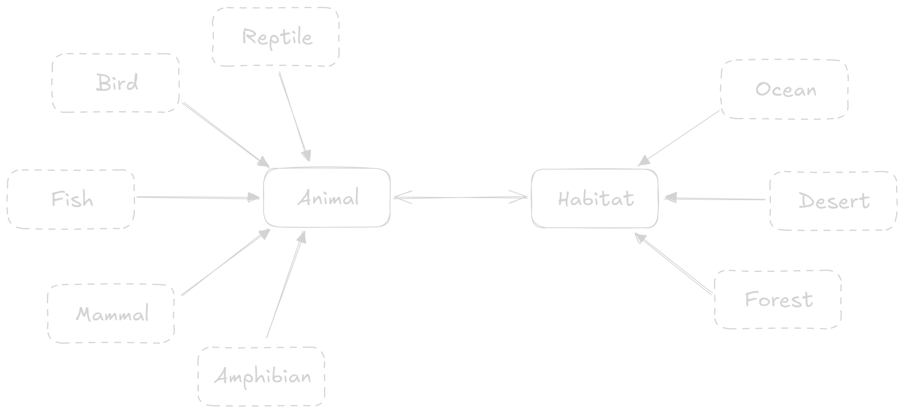

# Animal Habitat 🐦

This is a C++ program that demonstrates core object oriented programming (OOP) components. These components are encapsulation, inheritance and polymorphism. This is done using 2 main classes, the `Animal` and `Habitat` class, which have a many to many relationship with each other.



## Encapsulation

Yet to implement proper encapsulation.

## Inheritance

There are various classes that inherit from these main classes. The `Bird`, `Fish`, `Mammal`, `Reptile` and `Amphibian` classes inherit from the `Animal` class, while the `Ocean`, `Desert` and `Forest` classes inherit from `Habitat`. The derived classes only have one extra attribute (corresponding to pne of its characteristics) in order to implement generalization.

## Polymorphism

Classes make demonstrate polymorphism by overriding function and using virtual functions. Function overriding is when a function of the same signature as in the base class is present in the derived class. Both the `Animal` and `Habitat` classes have a `Print` function is also present in classes derived from them. This allows the derived classes to have their own implementation of the `Print` function.

## Virtual Functions

Polymorphism is fully enable when the previously mentioned `Print` function is marked with the `virtual` keyword. This allows the derived classes to use the overridden functions whilst being stored in a variable of the base class data type. Without `virtual`, the derived class would end up calling the `Print` function in the base class.

```cpp
Animal * fish = new Fish(...); // Fish(derived) object pointer is stored in Animal(base) class
fish.Print(); // Calls overridden print function in the Fish class
```

The `virtual` keyword also plays a very important role for the class `Destructors` in this program. Since the objects are dynamically created throughout the program and stored in pointer variables, extra care needs to be taken when de-allocating memory. To ensure the derived classes are properly deleted, we make the destructor of the base a virtual destructor.

```cpp
 virtual ~Animal();
 virtual ~Habitat();
```

Memory de-allocation without virtual base destructor:

```sh
[LOG] Animal default destructor called
[LOG] Animal default destructor called
[LOG] Habitat destructor called
[LOG] Habitat destructor called

```

Memory de-allocation with virtual base destructor:

```sh
[LOG] Bird default destructor called
[LOG] Animal default destructor called
[LOG] Fish default destructor called
[LOG] Animal default destructor called
[LOG] Forest destructor called
[LOG] Habitat destructor called
[LOG] Ocean destructor called
[LOG] Habitat destructor called
```

## Getting Started

To run this program locally, make sure you have a C++ compiler (like G++) installed. First fork and clone this repo onto your machine. Then, run the following commands:

Compile the program:

```sh
 g++ -o app.exe main.cpp animal.cpp animal.h habitat.cpp habitat.h
```

Run the program:

```sh
./app.exe
```

Alternatively, you can compile and run the program using Dev C++. Download the code files and place them into a project. Then rebuild and run the project to view the output.

## Learning Resources

- [C++ programming language guide](https://www.geeksforgeeks.org/c-plus-plus)
- [C++ sample projects (CS112)](https://github.com/anav5704/CS112-Projects)
- [C++ roadmap](https://roadmap.sh/cpp)
